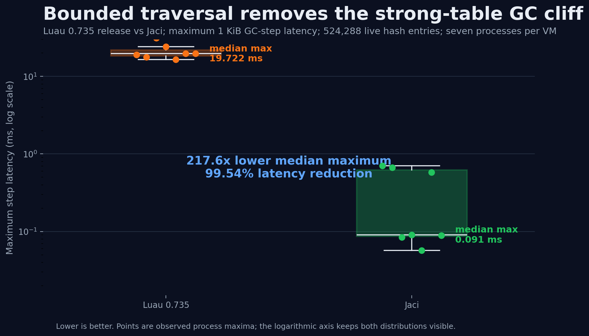
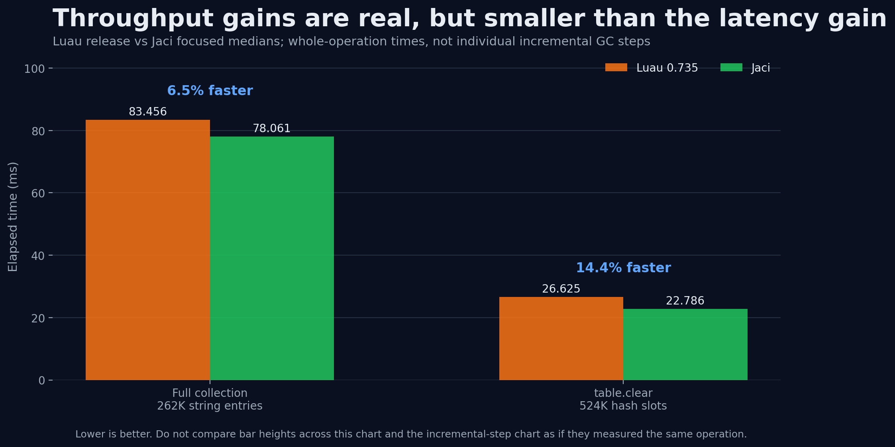
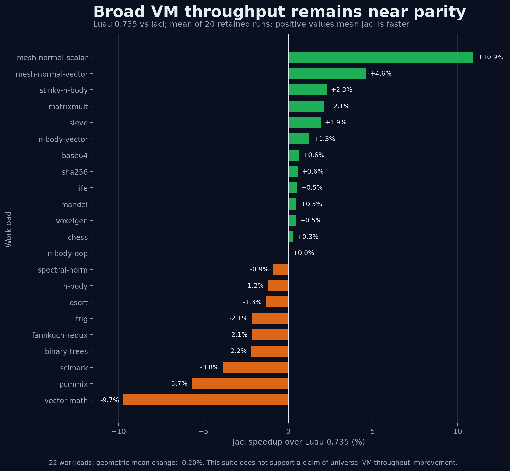
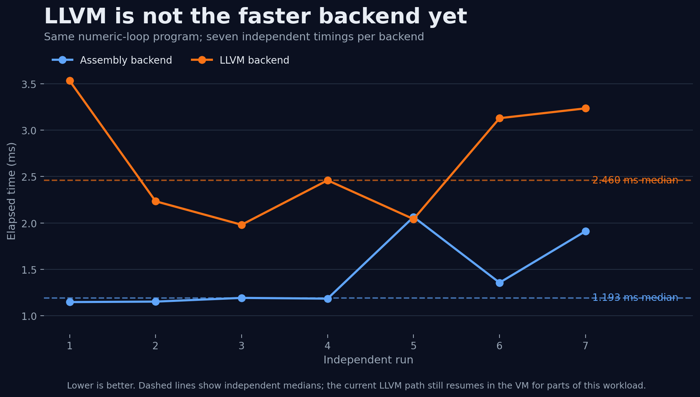

“Near-zero cost” is a useful engineering direction, but it is not a benchmark result. A virtual machine can make one path extremely cheap while moving work into another phase, increasing memory retention, or breaking a rare semantic case. The only defensible claim is narrower: **for a defined workload, on a defined build and machine, a change reduced measured cost without changing observable Luau behavior**.

This article explains Jaci from that narrower and more useful perspective. It follows the actual line of reasoning behind the recent table and garbage-collector work: what the old implementation did, where latency came from, which attractive optimizations failed, why the retained design is safe, and where the collector still exceeds one millisecond.

It also corrects an earlier version of this article. That version presented prototype components and synthetic C++ comparisons as if they were end-to-end VM results. In particular, it overstated runtime table specialization, small-string optimization, interrupt costs, LLVM speedups, and universal sub-millisecond GC latency. Those claims have been removed. The implementation and tests—not the ambition—define the architecture described below.

## Start with the compatibility boundary

Jaci is an asymmetric superset of Luau: valid Luau programs should retain their behavior, while Jaci may expose additional standalone and systems APIs. That requirement sharply limits VM optimization.

For tables and garbage collection, preserving behavior means much more than returning the same value in a simple script. Reachability has to remain correct through the array part of a table, through hash nodes, through metatables, and through objects such as closures, threads, suspended coroutines, captured upvalues, buffers, and vectors. A weak-key table must not accidentally keep its keys alive. A weak-value table must not lose a value while another strong root still reaches it. Changing `__mode` during a collection cannot leave the collector applying the old rule to half of the table and the new rule to the other half.

Mutation is the difficult boundary. Incremental collection deliberately allows the program to run between GC slices. During that interval, the program can replace a value, add a key, grow the array part, trigger a hash reallocation, replace a metatable, or request a full collection. A fast scan that is correct only while the table remains frozen is not compatible with Luau. The write barrier and collector state have to make every one of those interleavings safe.

The public boundary matters too. Jaci retains the existing `LuaTable` representation and the public `lua_gc` behavior. The final change is therefore deliberately less dramatic than the previous article suggested. Jaci did **not** replace every runtime table with a hidden-class object, did not convert numeric arrays into a new unboxed storage format, and did not add a scan cursor to every table. It optimized traversal around the existing Luau representation, where a table still has an array part for integer positions and a hash-node part for other keys.

That choice is central to the result. It keeps the compatibility surface small: one collector-owned continuation understands the old object; the object does not have to understand a new collector.

## The old problem: an incremental step contained indivisible work

Luau uses an incremental tri-color mark-and-sweep collector. The collector assigns a byte-work budget to each incremental step so the mutator can regain control regularly. Most GC work already obeyed that budget. A large table did not.

When the collector reached a table, `traversetable` walked the entire array and hash storage in one call. The outer collector charged the total work afterward, but that accounting could not undo the pause that had already happened. A nominal 1 KiB GC step could therefore contain a scan of hundreds of thousands of entries.

The decisive reproduction used a native probe around every `lua_gc(LUA_GCSTEP, 1)` call and recorded the collector state on both sides of each step. With a strongly reachable 524,288-entry hash graph, Luau 0.735 produced **16.478–31.218 ms** maximum steps across seven independent processes. The problem was not the overall collection schedule; it was one indivisible operation inside that schedule.

This distinction matters. A benchmark that times a whole allocation batch can show throughput, but it cannot identify which collector phase caused the tail. The phase-level probe did.

## The reasoning path: optimize, measure, reject

Several ideas looked faster in isolation and were still wrong for the VM.

### Manual unrolling and prefetching

Manually unrolling table scans and prefetching future nodes seemed likely to improve cache throughput. Mixed tables did not support that expectation consistently. The added instructions and altered access pattern either produced noise or regressions, so the changes were removed.

### A primitive-only tag gate

Another prototype tried to skip generic mark dispatch for groups of primitive table slots. It helped a narrow synthetic shape but reduced an object-heavy churn benchmark from roughly **7.0–7.2 million** allocations per second to roughly **5.1–6.2 million**, with worse pauses. The optimization selected the wrong workload and was reverted.

Jaci retained a smaller version of the idea only where the object model proves it is safe: strings, buffers, and heap vectors cannot contain outgoing GC edges, so `markvalue` can mark those leaf objects directly without sending them through the generic object dispatcher.

### More `grayagain` propagation

Moving more work into an extra propagation pass appeared to reduce the final atomic phase. In the churn workload, however, the sampled logical heap grew from roughly **16 MiB to 95 MiB**. Lower pause time obtained by retaining far more memory is not a free optimization. That design was reverted.

### Early sweep termination

A sweep early-exit prototype improved a contrived fragmented-page case by only about two percent and added a branch to the common live-object path. That trade was rejected as too small and too workload-specific.

The retained changes are the ones that survived both semantic testing and representative A/B measurement.

## The retained design: make table marking resumable

Jaci adds one table-scan continuation to `global_State`. It stores the active table, observed metatable, array and hash cursors, weak-mode flags, and weak-list state. Individual tables gain no fields and their public representation does not change.

When a table is larger than the remaining GC budget, the collector:

1. removes the table from the normal gray queue and records it as the active continuation;
2. scans array values and hash nodes only until it consumes the current byte budget;
3. keeps the table gray because unvisited strong edges may still point to white objects;
4. resumes from the saved cursors during the next incremental step;
5. turns the table black only after all required strong edges have been marked.

The cursors solve latency, but they introduce a correctness question: what happens if the mutator changes a slot that the collector has already passed?

The write barrier answers that question. Table writes perform one predictable comparison against the single active continuation pointer. If the write targets that table, Jaci restarts the relevant cursors. Rescanning is conservative, but it prevents a newly stored white object from hiding behind an already scanned position. A resize uses the same restart mechanism.

Metatables require another safeguard. Between chunks, the collector re-reads the table metatable and its `__mode`. If the weak-key or weak-value interpretation changes, the scan restarts under the new rules. The implementation also preserves the weak-list link across partial scans and only removes an eligible empty weak table after a complete scan proves that no entry needs atomic clearing.

A forced full collection cancels an active continuation, returns the interrupted cycle to a valid sweep state, and starts a complete mark cycle from the roots. This behavior has a dedicated test because simply dropping a cursor without restarting the collector would be unsafe.

## Small table and allocator wins around the main fix

The continuation fixes tail latency. Several smaller changes improve throughput without changing table semantics:

- Tables without metatables skip `__mode` lookup entirely.
- Fully strong hash tables use a separate loop without weak-key and weak-value branches on every node.
- Atomic weak clearing checks only the sides that are actually weak.
- `table.clear` bulk-resets hash-node storage instead of rewriting every node field separately.
- Empty 16 KiB and 32 KiB GC pages enter bounded, size-segregated pools and can be reused before calling the host allocator. The pools are capped at 128 small pages and 32 large pages—at most 3 MiB retained—and are released when the state closes.
- Leaf objects with no outgoing references are marked directly.

These are intentionally local changes. They do not claim that a table lookup has become a one-cycle load, that numeric table values are unboxed, or that temporary tables are universally scalar-replaced. Jaci contains table-specialization and HIR/MIR research components, but the current production JIT path described below is different, and synthetic helper benchmarks are not evidence of end-to-end runtime speedup.

## What the measurements show

The following results compare Jaci with the latest upstream release available during this work, [Luau 0.735](https://github.com/luau-lang/luau/releases/tag/0.735), on the same development machine. Both sides use Release builds and the same benchmark program. They are engineering evidence for these workloads, not universal guarantees for every host or application.

| Workload | Luau 0.735 | Jaci | Interpretation |
| --- | ---: | ---: | --- |
| 524,288-entry strong hash graph, 1 KiB steps | 16.478–31.218 ms max | 0.057–0.703 ms max across seven processes | Jaci budgets strong-table traversal instead of paying for the complete hash scan in one step. |
| Same scale, ordinary metatable | 20.800 ms max | 0.028 ms max | Re-reading metatable state between chunks did not restore the old tail. |
| Emptied 524,288-slot weak-value cache | 3.023 ms max | 1.905 ms max | The public step call can combine sweep pages; individual propagation and sweep work stayed below 0.1 ms. |
| 400 full collections, 262,144-entry string table | 83.456 ms median | 78.061 ms median | About 6.5% lower full-collection time for this workload. |
| `table.clear` hash benchmark | 26.625 ms | 22.786 ms | About 14.4% faster bulk clearing in this benchmark. |

Hardware counters over the traversal workload reported roughly **2.5% fewer instructions** and **4.4% fewer branches** after separating the common strong-table path. Branch misses were effectively unchanged.

The added continuation check also runs on table writes, so it needed its own regression test. Two paired median runs of 65,536-key hash insert, update, lookup, and removal phases overlapped in both directions: some candidate phases were faster, others slower. Hardware counts were likewise within run-to-run variation. The correct conclusion is **no consistent measurable regression**, not that every table operation became faster.

The focused GC results must not be presented as if every program became dramatically faster. A broader Release-mode comparison ran 22 existing workloads with 20 retained timings per VM. Jaci won 12 workloads and lost 10. The largest measured win was **10.9%** in `mesh-normal-scalar`; the largest loss was **9.7%** in `vector-math`. Across the complete set, the geometric-mean change was **0.20% slower**, which is effectively parity at this measurement scale. The optimization is valuable because it removes the strong-table latency cliff while preserving general VM throughput, not because it makes every benchmark faster.

### How to read these numbers

- “Maximum” is sensitive to scheduler noise. This is why the final strong-table result is reported as a range across runs and accompanied by p99.
- Full-collection medians measure throughput-oriented work; per-step probes measure latency. They answer different questions.
- These are microbenchmarks designed to isolate a mechanism. They do not replace application traces.
- The comparison preserves the same Luau program and collector semantics. Results from C++ functions that merely simulate “generic” and “specialized” tables are not included as VM speedups.

## The honest limit: live weak tables still have an atomic tail

The collector is not universally sub-millisecond.

A 524,288-entry weak-value table whose values are all kept alive by a separate strong root still requires atomic closure and weak-table processing. Across four final runs, that indivisible transition measured **10.992–16.047 ms**.

Why not yield halfway through it? Luau's current atomic phase assumes the mutator cannot run between closure, weak decisions, and clearing. Safely making that work resumable would require at least:

- allocation coloring rules for objects created while atomic work is suspended;
- dirty weak-table tracking for mutations between slices;
- resumable ephemeron/weak convergence and clearing state;
- barriers and invariants that cover the new interleavings.

Adding a cursor without those mechanisms could collect a reachable object or retain an object that should be cleared. Jaci therefore leaves this phase indivisible and reports it as the current architectural boundary. The strong-table result is genuinely sub-millisecond in the measured probe; the whole collector is not yet guaranteed to be.

## Where LLVM actually fits today

Jaci has a real LLVM backend, but its current architecture is more conservative than the former article described.

The active path is:

`Luau bytecode → existing Luau IR → constant/dead-store optimization → LLVM lowering → LLVM O2 → ELF relocatable object → Jaci object loader → code allocator`.

Each compiled proto uses a standard C-compatible function contract. Unsupported or unsafe-to-lower instructions write the correct resume position to `savedpc`, return to the VM, and continue in the interpreter. This fallback-first protocol keeps the interpreter as the semantic reference while LLVM coverage grows.

The hand-written x64/AArch64 backend remains available. A build without LLVM uses it, and the current same-program benchmark does not show LLVM winning yet. In seven runs of the numeric-loop backend comparison, the independent medians were **1.193 ms for the assembly backend** and **2.460 ms for LLVM**. The test itself explains why: current LLVM entries still resume in the VM for parts of the workload. Correctness and coverage are ahead of peak performance.

This is a healthier description than saying LLVM has replaced all assembly or automatically makes every workload faster. LLVM provides a real optimization and target-emission pipeline; Jaci still has to lower enough VM semantics efficiently to benefit from it.

## FFI: less wrapper code, not magic or automatic memory safety

Jaci's `ffi` module is implemented and tested. It supports dynamic library loading, symbol lookup, a C-declaration parser, sized primitive types, struct layout, typed buffer reads and writes, and native calls. Security modes and library allow/deny policies can reduce exposure.

That does not make arbitrary native access memory-safe, nor does it prove “zero overhead.” Argument classification, validation, symbol dispatch, and the platform calling convention still have costs. In permissive mode, raw pointers remain raw pointers. Strict-mode low-address checks can reject null or guard-page-like pointers, but they do not prove ownership, lifetime, bounds, or thread safety.

The accurate value proposition is practical: Jaci removes much of the custom C-wrapper boilerplate and gives standalone programs a direct systems boundary. Applications still own the safety contract of the native libraries they call.

## How correctness was tested

The final GC/table change passed:

- **5,152/5,152** unit tests with **21,277** assertions;
- **332/332** Luau conformance tests with **6,450** assertions;
- the 10-test GC suite in normal, AddressSanitizer, and no-LLVM builds;
- 100 randomized normal GC-suite repetitions;
- 25 randomized AddressSanitizer GC-suite repetitions.

Dedicated cases cover active-scan mutation, array growth and hash reallocation, metatable replacement, weak-mode changes, a forced full collection during a partial scan, and mixed graphs containing tables, buffers, vectors, closures, suspended coroutines, and captured upvalues. Internal validation also runs while a continuation is paused, not only after the collection completes.

Passing tests cannot prove compatibility with every possible Luau program. They do show that the retained optimization survived the known semantic boundaries, the full repository suite, sanitizer instrumentation, a backend-isolation build, and repeated randomized execution.

## Conclusion

The important result is not that Jaci made garbage collection “free.” It did not. The result is that a specific, previously unbounded strong-table operation now obeys the incremental work budget while preserving Luau semantics, and the remaining non-sub-millisecond case is identified precisely.

The engineering method is reusable:

1. measure the phase that owns the tail;
2. preserve a behavioral reference;
3. reject optimizations that only win synthetic cases or move cost into memory;
4. add state only where the invariant can be explained;
5. test mutations and uncommon semantics, not only steady-state throughput;
6. publish the limit together with the win.

That is what “near-zero cost” should mean in Jaci: not a promise that cost disappeared, but a continuing effort to make common costs small, bounded, measurable, and honest.
