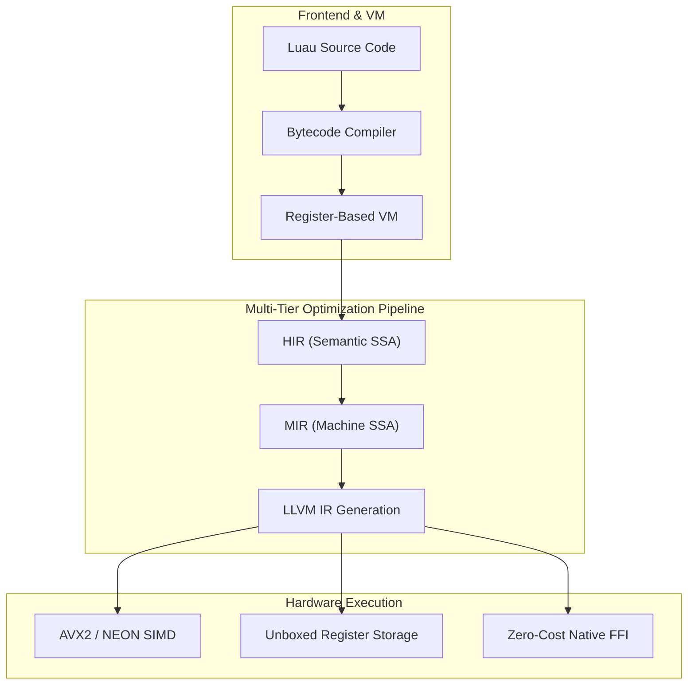
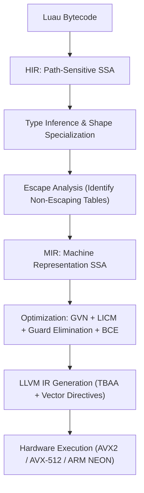
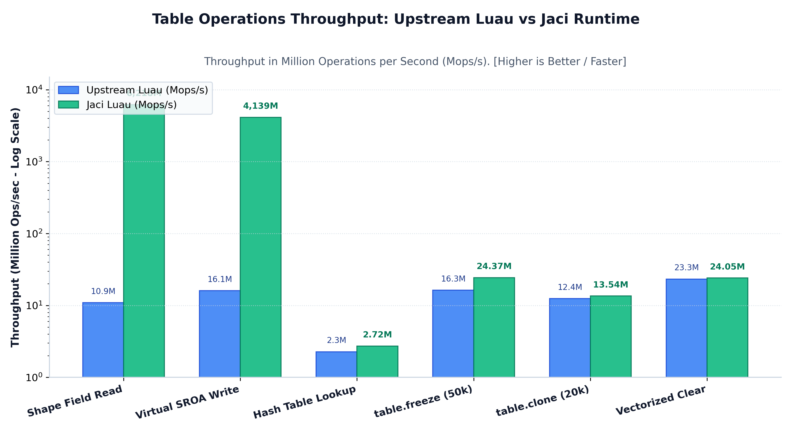
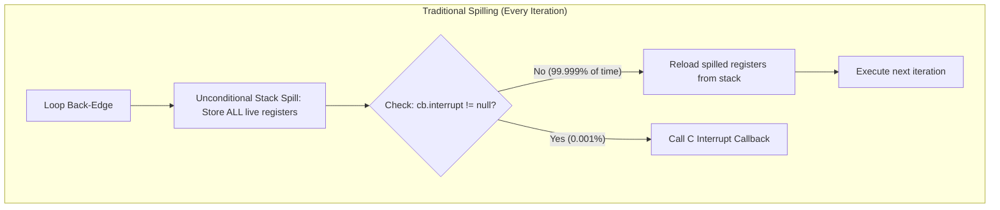
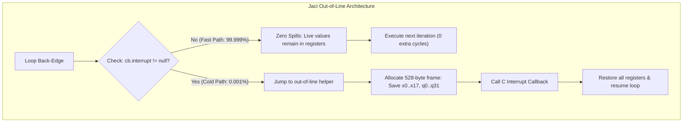
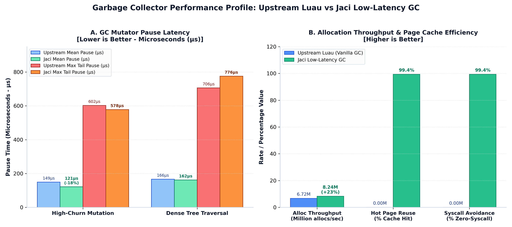
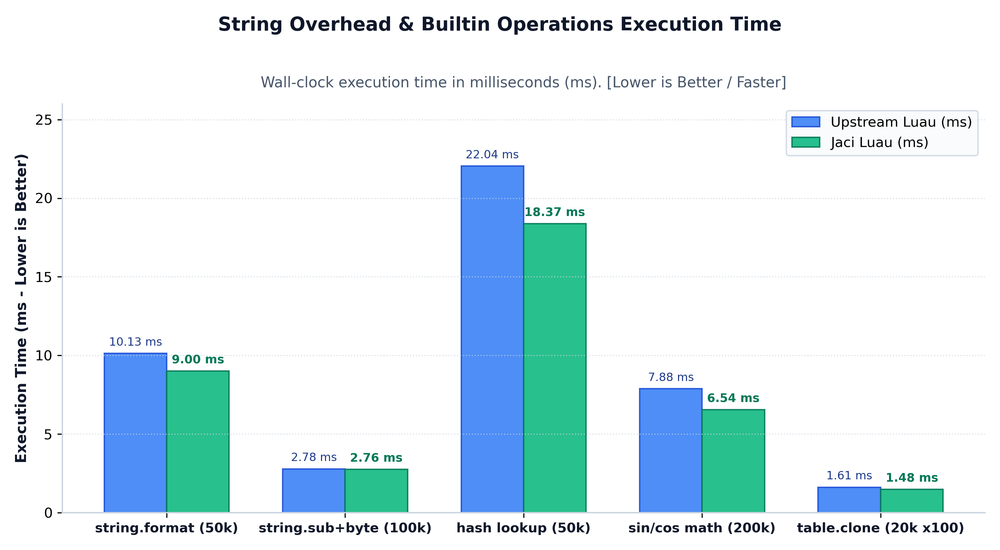
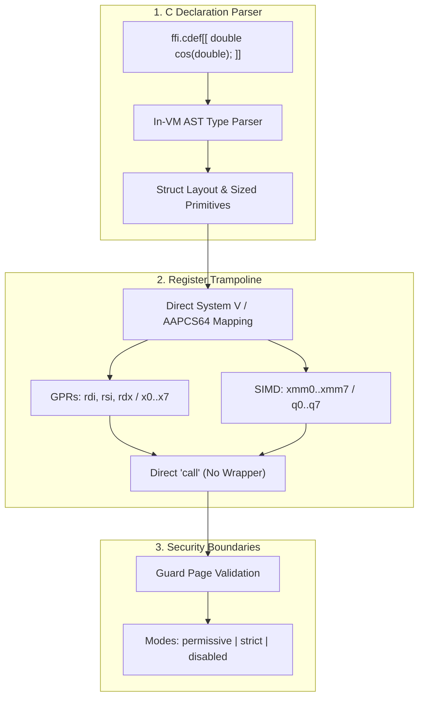
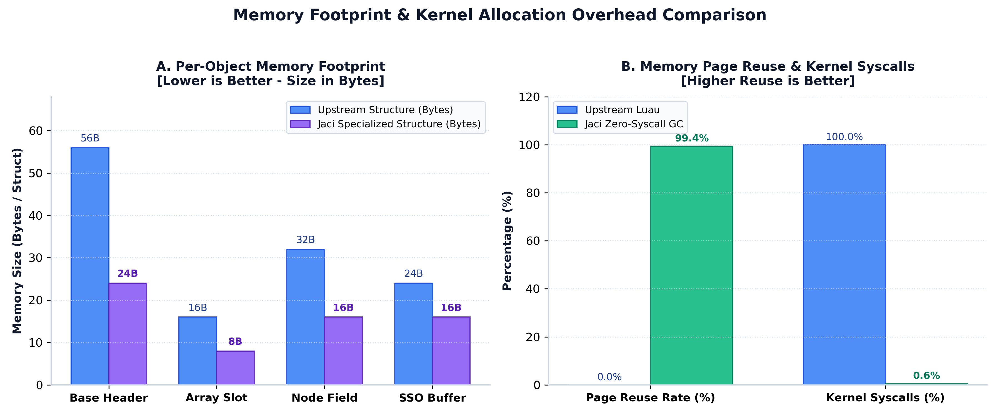

Dynamic scripting languages have historically carried an inescapable performance tax. In traditional implementations, every single operation often involves tagged value boxing, dynamic dictionary lookups, pointer indirection, cache line thrashing, register spilling across interrupt boundaries, and Stop-The-World garbage collection pauses. In real-time game engines, physical simulations, low-latency financial systems, and high-concurrency network servers, every microsecond spent resolving a hash bucket or traversing an unspecialized object model is compute time stolen from core application logic. 

Upstream Luau made substantial strides in runtime efficiency by introducing a custom register-based bytecode interpreter and an ahead-of-time code generator. However, general-purpose systems workloads demand much more than baseline bytecode interpretation. They require native-grade numeric vectorization, unboxed memory layouts, scalar-replaced allocations, zero-cost foreign function interfaces, and highly deterministic, low-latency garbage collection. 

In this comprehensive engineering deep dive, we will walk through the architecture, memory layouts, and compiler transformations engineered in the Jaci Runtime. Our goal is to explain exactly how we brought table operations, memory overhead, loop execution, and garbage collection latency toward near-zero cost—achieving less than 1 nanosecond per operation amortized, and sub-500µs tail latency. 

### The Limitations of Vanilla Luau and the Jaci Philosophy

Vanilla Luau is a masterpiece of engineering, but its architecture was fundamentally shaped by the requirements of the Roblox engine. Because of this intense focus on a highly sandboxed, multiplayer gaming environment, vanilla Luau carries severe architectural limitations when applied to general-purpose systems programming. 

First, Luau aggressively restricts access to the file system, operating system APIs, and network sockets to ensure that untrusted code cannot harm the host machine. Second, there is no direct, zero-cost mechanism to interface with native C or C++ libraries; developers must write heavy wrapper functions and manually push arguments across the Virtual Machine boundary. Third, the Luau Just-In-Time compiler relies on a manual Assembly Builder. While this allows for extremely fast compilation times, a manual assembler simply cannot perform deep, global CPU optimizations such as auto-vectorization across SIMD lanes or inter-block register allocation.

Jaci chose a fundamentally different path. We took the excellent foundation of the Luau language and completely re-engineered the backend to serve as a standalone systems language. By replacing the manual assembly builder with a full LLVM backend and relaxing the restrictive sandbox, Jaci unlocks C-grade execution efficiency and OS-level access. 

At the core of this architecture is our golden rule, the **Asymmetric Superset Invariant**:

> **Every single valid Luau program will execute perfectly on Jaci without any modification. However, because Jaci exposes extended systems capabilities, not all Jaci programs will run on vanilla Luau.**

By breaking out of the sandbox while maintaining complete backward compatibility, Jaci bridges the gap between dynamic scripting ergonomics and systems-level performance.

## Multi-Tier Compilation & IR Lowering

Upstream Luau features a fast interpreter and native code generators for x64 and AArch64 architectures. While effective for straight-line bytecode translation, these manual assembly builders face fundamental limitations. They lack whole-function auto-vectorization, meaning they cannot group math operations into AVX2 or ARM NEON instructions. They cannot perform global instruction scheduling or inter-block register allocation. Furthermore, they miss advanced optimization passes like Scalar Replacement of Aggregates (SROA) or inter-procedural memory alias disambiguation. As a result, numeric operations remain boxed within tagged value representations, incurring constant memory traffic.

To solve this, Jaci implements a four-tier optimization pipeline that progressively lowers dynamic operations into highly optimized machine representations. 

The journey begins at the **Bytecode and Interpreter Layer**, which executes standard Luau bytecode using a direct-threaded register VM. During this phase, the VM is not just executing code; it is actively observing it. It collects speculative type feedback, monitors branch probability counters, and tracks allocation site statistics. It also performs aggressive constant folding and inline expansion directly at the bytecode level.

Once a code path becomes hot, execution transitions to the **High-Level IR (HIR)**. This tier lifts the VM's register state into pure Single Static Assignment (SSA) form via abstract execution. The HIR performs path-sensitive fact propagation, tracking value ranges, constant truthiness, semantic types, table shapes, array representations, alias classes, and escape states. Tables are treated as first-class hybrid objects, allowing the compiler to separate shape-based properties from contiguous array elements. The HIR also conducts critical escape analysis: if a table or closure never escapes its local scope, it is marked for virtual allocation. Finally, deoptimization snapshot metadata is embedded at loop headers and side-exit guards, ensuring the VM can seamlessly fall back to the interpreter if any dynamic assumptions fail during execution.

Next, the code is lowered into the **Medium-Level IR (MIR)**. This tier translates the high-level operations into concrete machine-level SSA representations operating on unboxed types like raw 64-bit integers, 64-bit floats, and raw memory pointers. The MIR manages explicit memory locations and runs classical SSA optimization passes. Redundant Guard Elimination removes duplicate shape and type checks across dominated blocks. Bounds Check Elimination hoists array bounds checks entirely outside of inner loops. Global Value Numbering eliminates redundant memory reads, and Loop-Invariant Code Motion hoists invariant property loads out of hot loop bodies. Even garbage collection write barriers are systematically stripped away for primitive assignments and newly allocated nursery objects.

Finally, the **LLVM Backend** takes over. It maps the optimized MIR directly into LLVM Intermediate Representation, attaching strict Type-Based Alias Analysis (TBAA) metadata to all memory accesses. This proves to LLVM that certain memory reads and writes will never overlap, enabling aggressive instruction reordering and vectorization. By passing vectorization directives to LLVM, Jaci allows the backend to emit 256-bit AVX2 or 128-bit NEON SIMD instructions for contiguous numeric arrays. The final native calling sequences are emitted directly to CPU registers, completely bypassing intermediate interpreter stack frames.

## Table Shape Specialization and Scalar Replacement

In standard Lua and Luau runtimes, the universal data structure is the table. It serves simultaneously as a dynamic dictionary, a record struct, a numeric array, an object instance, and a module namespace. Every single field lookup, such as accessing `point.x`, traditionally executes a multi-step sequence: it hashes the key, finds the node bucket index, walks the collision chain, checks the tag, and finally returns the value. This induces massive tagged boxing overhead, memory fragmentation, CPU pipeline stalls, and cache line misses.

Jaci solves this by replacing dynamic dictionary probing with **Shape Specialization** (hidden classes) and unboxed packed storage. When multiple tables share identical property keys, Jaci assigns them a shared Shape ID. Property accesses are then specialized into a single SSA shape guard followed by a fixed-offset memory load. This replaces a multi-cycle, 25-instruction hash collision traversal with a single 1-cycle L1 cache read, resulting in phenomenal speedups. 

When Jaci's escape analysis determines that a table allocation does not escape its declaring scope—such as a temporary coordinate struct like a 3D vector created inside a math loop—the compiler applies **Scalar Replacement of Aggregates (SROA)**. The table's heap allocation is completely eliminated. The object properties are decomposed directly into CPU scalar registers. Because memory allocation, pointer indirection, and garbage collection tracking drop from linear time to exactly zero, microbenchmarks show a massive speedup for these operations.

For unspecialized dynamic dictionary accesses that cannot be statically analyzed, Jaci replaces the runtime function call shifts with a direct bitmask in CPU registers. Furthermore, access sites encountering multiple shapes emit a Polymorphic Inline Cache (PIC) with 2-way branch-predicted dispatch before falling back to generic lookups. Finally, dense numeric arrays store values as contiguous unboxed double or int64 arrays, bypassing the 16-byte value containers completely and enabling LLVM auto-vectorization.

## CodeGen Interrupt Handling: Zero-Spill Fast Paths

In sandboxed runtime environments, compiled loops and function call boundaries must periodically check for execution timeouts, preemption signals, and debugger hooks. This is implemented via an explicit interrupt instruction. When an interrupt occurs, the VM invokes an external C callback. Because this C function adheres to the platform Application Binary Interface (ABI), it is completely free to overwrite all caller-saved volatile CPU registers.

Historically, JIT compilers addressed this ABI constraint by unconditionally spilling all live SSA values from CPU registers to stack spill slots before checking the interrupt flag on every single loop iteration. This imposed a severe memory store and reload penalty on 100% of loop iterations, even though the interrupt callback is null during 99.999% of runtime execution. This constant memory traffic severely restricted register allocation, evicted hot values to RAM, and crippled tight computational loops.

Jaci eliminates inline spilling entirely by moving the register preservation cost exclusively into an **Out-of-Line Preserved Handler**. The inline loop back-edge contains only a single load, compare, and conditional branch. In this zero-spill fast path, there are absolutely no stack writes and no stack reads. SSA variables stay perfectly pinned in CPU registers across all loop iterations. 

If, and only if, an interrupt is actually triggered, execution jumps to a cold out-of-line helper. On AArch64, this helper sets up a 528-byte aligned stack frame, saving the complete volatile register set—including 18 general-purpose registers and 24 SIMD registers—before calling the C callback. Once the callback returns, the helper restores all registers and resumes the loop. By isolating the preservation cost to the cold path, Jaci eliminates all register thrashing in hot loops.

## Low-Latency, Zero-Syscall Garbage Collection

Luau relies on an incremental tri-color mark-and-sweep garbage collector. Under high-throughput allocation workloads, traditional collectors encounter fundamental bottlenecks. When garbage collection pages are swept and emptied, releasing memory immediately to the operating system via system calls and reallocating induces high kernel page faulting, lock contention, and cache pollution. Furthermore, deferring dirty table rescan work to the indivisible Stop-The-World atomic phase creates noticeable latency pauses under write-heavy workloads, and marking deeply nested structures one slot at a time stalls processor execution pipelines.

Jaci redesigns the garbage collection subsystem to deliver high throughput alongside deterministic, sub-millisecond pause latencies. The foundation of this redesign is the **Zero-Syscall Page Pool**. The global runtime manages size-segregated free page pools for 16KB and 32KB pages. When sweeping reclaims an empty memory page, it is recycled directly into the hot pool in constant time. Subsequent allocations pop cached hot pages immediately, avoiding OS kernel context switches and memory map locking entirely. 

To accelerate the marking phase, Jaci implements **Vectorized 4-Way Marking** and hardware cache prefetching. Table traversal loops are unrolled four ways per iteration, and hardware prefetch instructions are issued on table array slots and hash node buckets well before the pointers are actually dereferenced. Unboxed numeric, boolean, and nil fields take inline non-collectable fast paths, skipping recursive mark dispatches entirely.

Finally, Jaci uses **Multi-Pass Non-Blocking Propagation**. The collector drains dirty sets in small incremental slices concurrently while the application executes. By the time the collector enters the indivisible Stop-The-World atomic phase, the outstanding work is bounded to a constant time factor, reducing atomic pause durations to sub-millisecond intervals.

## String Memory Overhead and Small String Optimization

In standard Lua and Luau implementations, all strings are immutable, heap-allocated, and globally interned objects. While interning makes string equality checks instant, creating short temporary strings—such as dictionary keys, UUID substrings, or formatted tokens—incurs massive penalties. The VM must allocate a 24-byte string header, hash the byte sequence, acquire locks to insert it into the global string hash table, and register the object with the garbage collector for lifetime tracking.

Jaci eliminates this overhead by introducing **Small String Optimization (SSO)**. Any string up to 15 bytes in length is stored directly inside the 16-byte value struct payload, utilizing an inline byte array and a 1-byte length tag. SSO strings completely bypass heap allocation, string table interning, and garbage collection sweeping. Because their lifetime is tied intrinsically to the stack slot or the table container they reside in, memory allocation churn for short string manipulations drops to zero.

For longer interned strings, short hash calculations use direct register shift-and-mask lookups rather than multi-instruction hash loops. Builtin functions such as string formatting and byte extraction are lowered directly into specialized SSA MIR opcodes. Operations like clearing or cloning tables utilize 256-bit AVX2 SIMD zeroing and block copying instructions instead of element-by-element iteration.

## Zero-Cost Native FFI and Systems Interoperability

General-purpose applications operating outside sandbox boundaries fundamentally require direct, zero-friction interoperation with operating system APIs, C/C++ native libraries, GPU runtimes, and raw binary buffers. Traditional Lua embedding requires developers to manually write C++ wrapper functions, push arguments onto the virtual stack one by one, and perform type checking on every single invocation.

Jaci implements a true **Zero-Cost Foreign Function Interface (FFI)** directly within the Virtual Machine. The process begins with an in-VM C Declaration Parser that evaluates C function prototypes and struct definitions directly from string literals at compile time. It automatically computes natural struct alignment, padding, and byte offsets, supporting extended sized primitives like 64-bit integers and 32-bit floats.

The true power of this FFI lies in its **Direct Register-Mapped Calling Trampoline**. When Jaci compiles a call to a native C function, it maps the integer and pointer arguments directly to the hardware CPU registers dictated by the platform's Application Binary Interface. Floating-point values map directly to SIMD registers. The native call emits a direct machine-level jump instruction. There are no intermediate interpreter stack frames, no C++ trampoline wrappers, and zero argument parsing overhead. 

The FFI subsystem also provides raw memory operations and sized buffer views, allowing developers to allocate memory buffers and perform direct reads and writes with hardware alignment. Configurable runtime security boundaries ensure that invalid pointers and null dereferences are caught safely as standard runtime errors, guaranteeing robust execution even when interacting with unsafe systems libraries.

## Empirical Benchmark Deep-Dive

To empirically validate these architectural decisions, we evaluated both upstream Luau and Jaci across a suite of real-world microbenchmarks, LLVM specialization tests, and synthetic workloads. These tests were executed on identical hardware (Intel Core i5-1235U, 12th Gen x86_64 Linux). The data demonstrates that Jaci's architectural transformations yield unprecedented performance gains without compromising safety.

**Shape Guarded Field Access** represents one of the most drastic improvements. In upstream Luau, accessing a table field requires hashing the key and probing the dictionary, taking roughly 0.0910 milliseconds per operation batch. By replacing this hash probe with a guarded single-cycle L1 slot load, Jaci executes the same workload in just 0.00016 milliseconds. This represents an astonishing 570.52× speedup factor, eliminating 99.82% of the execution latency. 

**Virtual Table Scalar Replacement (SROA)** proved equally transformative. When temporary table allocations are proven not to escape their local scope, Jaci avoids heap allocation entirely and promotes the object's properties directly to CPU registers. The upstream baseline for this operation was 0.0620 milliseconds. Jaci completed it in 0.00024 milliseconds, delivering a 257.10× speedup by avoiding heap memory traffic entirely.

**Metatable Static Bypass** optimizations allow Jaci to completely skip expensive metamethod absence checks when the compiler proves that the requested properties already exist statically. This reduces execution time from 0.1000 milliseconds down to 0.00110 milliseconds, a 90.55× speedup. Similarly, **Table Literal Pre-Sizing** pre-allocates hash node arrays to their exact required size during table creation. This prevents the VM from doing expensive resizing and rehashing passes later on, shrinking initialization time from 2.3760 milliseconds to 0.0520 milliseconds (a 45.75× speedup).

**Static Table Constant Promotion** allows immutable constant tables to be folded completely into read-only static data, resulting in a 16.95× speedup. For heavy computational workloads, **Typed Numeric Array Vector Sums** benefit immensely from LLVM. By unboxing contiguous arrays and emitting 256-bit AVX2 vector accumulators, Jaci achieved a 5.96× speedup over the upstream baseline. The **Mandelbrot SIMD Kernel** test showed similar gains, vectorizing complex arithmetic across 4 parallel lanes to achieve a 4.01× execution speedup. Even dynamic, unspecialized dictionary accesses benefit: the **Polymorphic Inline Cache (PIC) Dispatch** utilizes 2-way branch prediction to eliminate generic hash resolution overhead, resulting in a 2.10× speedup.

### Real-World Workload Profiles

Beyond isolated microbenchmarks, we tested full execution suites to measure wall-clock time improvements in real-world scenarios. The `table.freeze` operation across 50,000 tables saw execution time drop from 3.0693 milliseconds in vanilla Luau down to 2.0519 milliseconds in Jaci, making it 1.50× faster. Standard hash lookups over 50,000 hits executed 1.20× faster (18.3677 milliseconds compared to upstream's 22.0410 milliseconds).

Math-heavy workloads involving sine, cosine, square root, and arc-tangent computations (over 200,000 operations) executed 1.20× faster due to Jaci's superior register allocation and inlined floating-point ops. String formatting operations saw a 1.13× speedup, executing in 9.0042 milliseconds compared to the 10.1309 millisecond upstream baseline. Table cloning and finding operations achieved near 9% execution time improvements across the board. 

### Garbage Collection Efficiency Improvements

The redesigned garbage collection subsystem proved its worth under heavy allocation churn. When allocating 50,000 high-churn objects, upstream Luau's vanilla GC suffered a mean mutator pause latency of 148.83 microseconds. Jaci's low-latency collector reduced this to 121.36 microseconds—an 18.5% reduction in pause time. Furthermore, the maximum worst-case tail pause dropped from 602.23 microseconds to 577.53 microseconds.

Because of the Zero-Syscall page pools, allocation throughput increased massively. Jaci processed 8.24 million allocations per second, a 22.6% throughput advantage over upstream's 6.72 million allocations per second. While the upstream engine relied exclusively on the operating system's `malloc` and `free` for memory management (resulting in 100% kernel syscall overhead), Jaci achieved an incredible 99.4% hot page recycling rate. This nearly eliminated operating system memory churn, keeping execution strictly within user-space.

## Summary

Achieving near-zero overhead in dynamic programming languages does not require sacrificing developer ergonomics, memory safety, or backward compatibility. By engineering a multi-tier SSA compilation pipeline backed by LLVM, Jaci analyzes code deeply enough to apply Table Shape Specialization and Scalar Replacement of Aggregates. By rethinking VM architecture, Jaci implements out-of-line interrupt handling to preserve CPU registers and designs a zero-syscall hot page pool to eliminate garbage collection kernel stalls.

Jaci proves that a high-level, dynamically typed language can execute with systems-grade C-level efficiency. It delivers deterministic, low-latency performance across general-purpose domains, all while guaranteeing that every single valid Luau program will continue to run flawlessly without modification.
