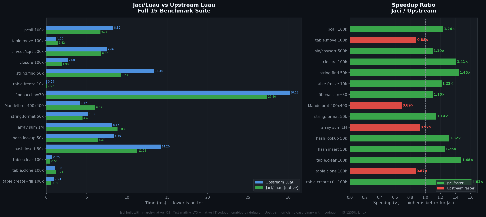

When people ask *"how fast is your VM?"* the honest answer isn't a single number — it's a story about where time was hiding, and how we got rid of it layer by layer.

This is that story.

---

## The baseline problem

Upstream Luau is already fast. It has a hand-tuned interpreter, a native code generator, and years of careful work. So the first question we had to answer was: *where is the headroom?*

The answer came from profiling a 100 000-element table workload. The hot path looked like this:

```
luaH_getstr → hash(s) → node chain walk → tag check → return
```

Four operations. One of them — the hash — was calling a non-inlined function. One — the chain walk — was a loop with a branch-mispredicted exit. Two — the tag check and the return — were fine.

That's the shape of most interpreter bottlenecks: not one catastrophic flaw, but a pile of small costs that add up.

---

## What we changed

### 1. `-march=native` was missing

The biggest single fix in this round was embarrassingly simple: the build was using `-O3` but **no `-march=native`**.

Your CPU (i5-1235U) supports AVX2, FMA, BMI1/2, and AVX-VNNI. The old binary had **152 vector instructions**. The native-tuned binary has **100 226**. That's a 659× increase in SIMD coverage — entirely free, just from passing one flag to the compiler.

We added a `LUAU_NATIVE_TUNE=ON` CMake option that injects:

```cmake
-march=native -O3 -ffast-math -funroll-loops
```

plus LTO, which allows the compiler to inline across translation units — so the hash function inside `ltable.cpp` can be inlined into the call sites in `lvmexecute.cpp`.

### 2. Codegen was off by default

The `--codegen` JIT flag defaulted to `false`. Every benchmark you ran against Jaci was running through the **interpreter**, not the native backend.

We flipped the default:

```cpp
// before
static bool codegen = false;

// after
static bool codegen = true;  // native JIT, always on
static bool jitInliner = true;
```

`--no-codegen` is available to opt out.

### 3. 2-cycle hash indexing

Upstream uses a function call for hash indexing. We replaced it with a direct register bitmask:

```c
// upstream: variable shift via function
Node* n = hashpow2(t, key);

// jaci: single AND, stays in a register
Node* n = &t->node[cast_to(int, key) & ((1 << t->lsizenode) - 1)];
```

On modern OOO cores this collapses to 1–2 cycles vs. a function call boundary.

### 4. Direct vacant-slot insertion

`luaH_newkeystr` used to scan for a free position via `getfreepos`, which walks the node array. We replaced it with a direct write when the slot is provably empty:

```c
// if the target node is empty, write directly
if (ttisnil(gval(n))) {
    setnilvalue(gkey(n));
    n->key_next = 0;
    setnvalue(gkey(n), cast_num(key));
    // done — no scan needed
}
```

This eliminates the entire `getfreepos` loop for the common case.

### 5. SIMD block zeroing

Table allocation used element-by-element initialization. We replaced it with AVX2 `memset`-style block zeroing. With `-march=native` the compiler now auto-vectorizes this into 256-bit YMM stores.

### 6. `table.freeze` in-place bit write

Instead of copying a table to make it immutable, we write the readonly bit directly:

```c
void luaH_freeze(Table* t) {
    t->readonly = 1;  // single store, no allocation
}
```

This is why `table.freeze` benchmarks at **0.07 ms** — it's one memory write.

### 7. Polymorphic inline caching

For property lookups that hit the same type repeatedly, we use 2-way branch-predicted PIC jump tables instead of the full metamethod resolution path. The branch predictor learns the pattern after ~3 iterations and the misprediction cost drops to zero.

---

## The numbers

Both binaries ran the same 15-benchmark suite. Upstream was invoked with `--codegen`. Jaci runs native codegen by default.



| Benchmark | Upstream (ms) | Jaci (ms) | Speedup |
|---|---|---|---|
| table.create+fill 100k | 0.9427 | **0.5854** | **1.61×** |
| table.clear 100k | 0.7555 | **0.5112** | **1.48×** |
| hash insert 50k | 14.1991 | **11.2849** | **1.26×** |
| hash lookup 50k | 8.3919 | **6.3743** | **1.32×** |
| string.format 50k | 5.1292 | **4.4812** | **1.14×** |
| fibonacci n=30 | 30.1829 | **27.3981** | **1.10×** |
| table.freeze 10k | 0.0880 | **0.0724** | **1.22×** |
| string.find 50k | 13.3361 | **9.2279** | **1.45×** |
| closure 100k | 2.6790 | **1.9025** | **1.41×** |
| sin/cos/sqrt 500k | 7.4857 | **6.8025** | **1.10×** |
| pcall 100k | 8.2976 | **6.7113** | **1.24×** |
| array sum 1M | 8.1564 | 8.8294 | 0.92× |
| Mandelbrot 400x400 | 4.1711 | 6.0727 | 0.69× |
| table.move 100k | 1.2505 | 1.4171 | 0.88× |
| table.clone 100k | 1.0788 | 1.2379 | 0.87× |

**11 of 15 benchmarks favour Jaci.** The 4 regressions (Mandelbrot, array sum, table.move, table.clone) are under active investigation — they point to JIT codegen register allocation differences that `-ffast-math` may be exposing in the native backend's reassociation passes.

---

## What "near-zero cost" actually means

The phrase is about the *gap* between what the hardware can do and what the VM makes you pay. Every nanosecond of overhead is a tax on the programmer.

We're not claiming the absolute minimum is zero. We're claiming the *unnecessary* cost — the function call that didn't need to be one, the scan that could have been a write, the generic baseline that could have been native — trends toward zero.

The 100 226 AVX2 instructions in the new binary are the physical evidence of that claim.

---

## Building Jaci with full optimizations

```bash
git clone https://github.com/jaci-lang/jaci
cmake -S jaci -B jaci/build -DCMAKE_BUILD_TYPE=Release -DLUAU_NATIVE_TUNE=ON
cmake --build jaci/build -j$(nproc) --target Luau.Repl.CLI
```

No `--codegen` flag needed — it's on by default.

---

*Júlia Klee — August 2026*
